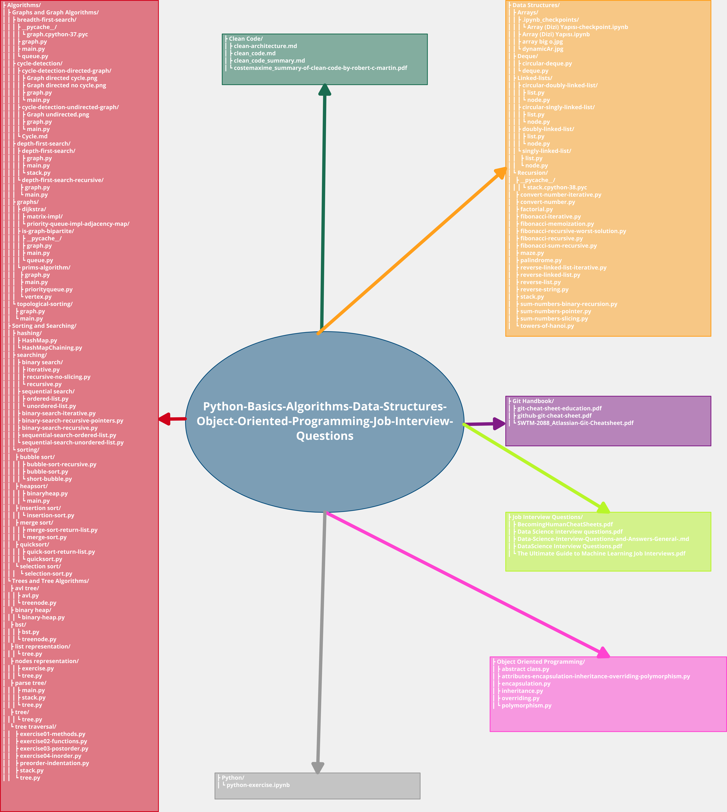

# Python Basics Algorithms Data-Structures Object Oriented Programming Job Interview Questions

Hello, this repo is a repository I've compiled with basic python exercises, algorithms, data structures, object-oriented programming, questions in job interviews (on data science, machine learning and deep learning), clean code and git usage.  

You can find all the resources I used to create the repo in the reference section. Enjoy it

<!-- START doctoc generated TOC please keep comment here to allow auto update -->
<!-- DON'T EDIT THIS SECTION, INSTEAD RE-RUN doctoc TO UPDATE -->
**Table of Contents**

- [Python Basics Algorithms Data-Structures Object Oriented Programming Job Interview Questions](#python-basics-algorithms-data-structures-object-oriented-programming-job-interview-questions)
  - [Folders and Files Tree in this Repo](#folders-and-files-tree-in-this-repo)
  - [📝 License](#-license)
  - [👨‍🚀 Show your support](#-show-your-support)
  - [References:](#references)
    - [Clean Code](#clean-code)
    - [Data Structures](#data-structures)
    - [Interview_Questions](#interview_questions)

<!-- END doctoc generated TOC please keep comment here to allow auto update -->

## Folders and Files Tree in this Repo

## 📝 License

This project is licensed under [MIT](https://opensource.org/licenses/MIT) license.

## 👨‍🚀 Show your support

Give a ⭐️ if this project helped you!

## References:
https://www.udemy.com/course/object-oriented-programming-masterclass-with-python-a-z/

### Clean Code
https://gist.github.com/wojteklu/73c6914cc446146b8b533c0988cf8d29
https://gist.github.com/leeweiminsg/b31495b05136a29ceff86f5c4967a697
https://gist.github.com/scottashipp/88b3a4d97eaa542842bcf5b08f5bac6d
https://gist.github.com/vaibhavpaliwal/508f4e67f7fd36209f2d92455b39de85
https://gist.github.com/jonnyjava/4f615567f0b55d361654
https://gist.github.com/zhehaowang/b6c9517dc690054670c8638f18a68a42
https://www.youtube.com/playlist?list=PLxw2ybf4zPJ5TncW4_IWqFSGGybTaXs5I

### Data Structures
https://www.udemy.com/course/algorithms-data-structures-and-real-life-python-problems/
https://github.com/Hemant-Jain-Author/Problem-Solving-in-Data-Structures-Algorithms-using-Python
https://github.com/ivanmmarkovic/Problem-Solving-with-Algorithms-and-Data-Structures-using-Python
https://github.com/OmkarPathak/Data-Structures-using-Python/tree/master/Arrays

### Interview_Questions
https://github.com/JifuZhao/120-DS-Interview-Questions/blob/master/DataScience_Interview_Questions.pdf
https://gist.github.com/felipemoraes/c423d1447ee13585e2270b27f174fb13
https://github.com/rbhatia46/Data-Science-Interview-Resources
https://github.com/conordewey3/DS-Career-Resources/blob/master/Interview-Resources.md
https://github.com/khanhnamle1994/cracking-the-data-science-interview/blob/master/DataScience%20Interview%20Questions.pdf
https://github.com/khanhnamle1994/cracking-the-data-science-interview
https://github.com/zhiqiangzhongddu/Data-Science-Interview-Questions-and-Answers-General-
https://www.interviewbit.com/python-interview-questions/
https://www.techbeamers.com/python-interview-questions-programmers/
https://www.youtube.com/watch?v=HGXlFG_Rz4E&ab_channel=edureka%21
